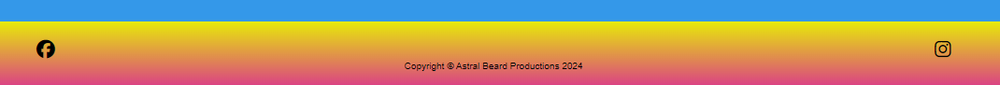

# Puppy Puzzle

<https://brianmcconway.github.io/puppy-puzzle-game/>

## Intro

- The purpose of this project is to create a fully functional front-end site that responds to users' interactions. In this case I have created a slide puzzle game. 
The object of the game is to rearrange the puzzle pieces to reveal the original image. The puzzle pieces can only swap with the 'blank' grey puzzle piece to move horizontally or vertically around the puzzle board. The game concludes when all the puzzle pieces are in the correct order and you are notified of how many moves it took you to complete the puzzle. There are interactive buttons which show how to play the game, to start a new game, and also to toggle on and off the background music. The default for audio is set to mute. 

## User Stories

- As a user, I would like to be able to play the puzzle game.
- As a user, I would like to be able to learn the rules before playing.
- As a user, I would like to be able to keep track of the amount of turns I have taken.
- As a user, I would like to see anotification when I have completed the puzzle.
- As a user, I would like to be able to start a new game at any time.
- As a user, I would like to confirm a new game start so I don't start again by mistake.

## Features

### Game Options

- The game options include a 'How to Play', 'New Game', and audio on/off buttons". The 'How to Play' button opens a pop-up window with instructions on how to play the game

  

**How to Play**
- This button opens a pop-up window that contains the rules of the game. There is a 'Close' button at the bottom of the window to exit back to the game.

    
    

**New Game**
- This buttton starts a new game at any time. You will be asked to confirm the request via a pop-up window where you can confirm or cancel the request.

    
    

**Audio on/off**

**Turns Counter**

- The Turns counter will increase by one every time a move is made in the puzzle. This will be displayed in the pop-up window when the puzzle is solved.

**End of Game Message**

- When the puzzle is solved, a pop-up message will congratulate you for solving the puzzle and let you know how many moves you made.

### The Footer

- The footer section includes links to the relevant social media sites for ABP. The links will open to a new tab to allow easy navigation for the user.
- The footer is valuable to the user as it encourages them to keep connected via social media.

    

## Future Features

- Future features will include recording of high scores, an audio alert when you complete the game (if audio is enabled), 

## Typography and Color Scheme

- The Honk font from Google Fonts will be used for this project Heading.
- A custom color palette from Adobe Color will be used for this project. This color pallet consists of #3498E9 for the background, #E7EB09 for the yellow which transitions to red #DA3A8A in the heading and footer

    
    

## Wireframes

   

## Technology Used

### Language Used

- HTML5, CSS3 & JavaScript were the languages I used in this project.

### Programs, Libraries & Frameworks Used

- Google Fonts was used to import the Honk font used for the heading text.
- Font Awesome was used for all social media icons contained in the project.
- VS Code Desktop was used to write the code.
- Inkscape was used to create the individual puzzle pieces.
- Favicon.cc was used to generate the favicon.
- Figma was used to design the wireframe for the project.
- Github was used to store the project code after being pushed.

## Testing

- W3C Markup Validator, W3C CSS Validator & JS Hint were used to validate all code contained in the project. The final tests were completed without errors. 
- Lighthouse developer tool was also used to gauge the performance of the project on desktop and mobile views. The desktop scored a 99, and the mobile test scored 72 for performance.

    
    

- All buttons and external links were tested manually to ensure there were no connection errors. The modals all open and close as expected, and external links open in a new page in the browser. 
- The project was also tested with Google's dev tools to show responsiveness on different screen sizes, and also on different browsers.
- Testing was done on several desktop and laptop computers, various mobile devices like the iPhone, Nokia, Samsung and Huawei to make sure that the navigation and external links were functioning correctly.
- Family members, friends and colleagues also kindly tested the functionality and user experience at several stages of the projects development.

### Known Bugs

- When refreshing the page, the win-modal appears for a fraction of a second on the reload. 
- On mobile view, the picture tiles were flasing when selected to move. I removed this by add -webkit-tap-highlight-color: transparent; to the body CSS. This has removed the flashing but shows up as a warning on the validator. 

## Deployment

- The code was written on VS Code desktop version, commits were commented and pushed to the relevant Github repository.
- The site was deployed to GitHub pages. The steps to deploy are as follows:
- In the GitHub repository, navigate to the Settings tab
- From the source section drop-down menu, select the Master Branch
- Once the master branch has been selected, the page will be automatically refreshed with a detailed ribbon display to indicate the successful deployment.

The live link can be followed here - <https://brianmcconway.github.io/puppy-puzzle-game/>

## Credits

**During this project I used:**
- https://rocoderes.com/slide-puzzle-game-in-html-css-and-javascript/  for puzzle-board sertup and movement of puzzle pieces.
- https://codeguppy.com/code.html?t=sliding_puzzle
 to help with the JavaScript for the movement of the puzzle pieces.
- https://www.youtube.com/watch?v=o5ffh3KUaTM to help with the creation of modals.
-  I also used Perplexity & ChatGPT which referenced MDN Web Docs including: Event Handling, Dom Manipulation, Arrays & Functions in JavaScript, 
- This Readme file template, for the suggested layout.

## Acknowledgements

- Friends, family and colleagues, for testing my project at every stage, and also for their feedback.
- My Mentor for constructive feedback and direction.
- Support from The Code Institute.